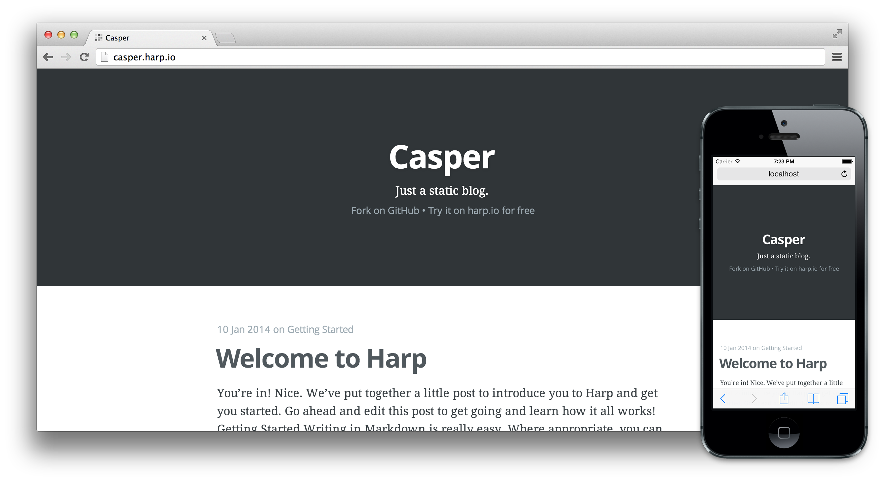

# Casper

The default theme for Ghost, as a static site.



## Get started

This blog template uses [Harp](http://harpjs.com), the static web server with built-in preprocessing.

The fastest way to get this blog online is [by using this template on the Harp Platform](https://harp.io/apps/new?boilerplate=kennethormandy/hb-casper). Choose a subdomain, connect to your Dropbox, and this template will be online and ready to make your own.

Then, if you’d like, install Harp locally and run the boilerplate:

```sh
sudo npm install -g harp
harp server ~/Dropbox/harp.io/apps/the-subdomain-you-chose.harp.io
```

You can see the local version running in your browser at [localhost:9000](http://localhost:9000).

### Deploying elsewhere

If you’re prefer to run this boilerplate without the Harp Platform, that’s no problem. Just clone the boilerplate and serve it with Harp locally:

```bash
sudo npm install -g harp
git clone https://github.com/kennethormandy/hb-casper.git
harp server hb-casper
```

## Copyright & License

Copyright &copy; 2014 Ghost Foundation & Kenneth Ormandy - Released under the MIT License.

Permission is hereby granted, free of charge, to any person obtaining a copy of this software and associated documentation files (the “Software”), to deal in the Software without restriction, including without limitation the rights to use, copy, modify, merge, publish, distribute, sublicense, and/or sell copies of the Software, and to permit persons to whom the Software is furnished to do so, subject to the following conditions:

The above copyright notice and this permission notice shall be included in all copies or substantial portions of the Software.

THE SOFTWARE IS PROVIDED “AS IS”, WITHOUT WARRANTY OF ANY KIND, EXPRESS OR IMPLIED, INCLUDING BUT NOT LIMITED TO THE WARRANTIES OF MERCHANTABILITY, FITNESS FOR A PARTICULAR PURPOSE AND NONINFRINGEMENT. IN NO EVENT SHALL THE AUTHORS OR COPYRIGHT HOLDERS BE LIABLE FOR ANY CLAIM, DAMAGES OR OTHER LIABILITY, WHETHER IN AN ACTION OF CONTRACT, TORT OR OTHERWISE, ARISING FROM, OUT OF OR IN CONNECTION WITH THE SOFTWARE OR THE USE OR OTHER DEALINGS IN THE SOFTWARE.
